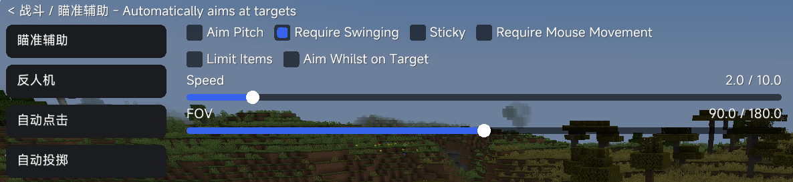
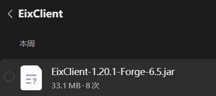
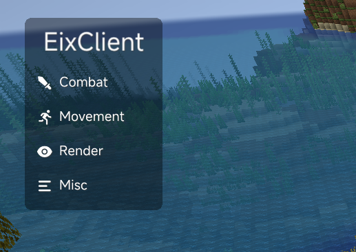
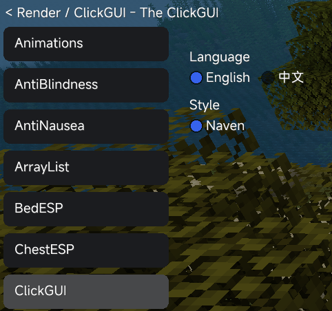
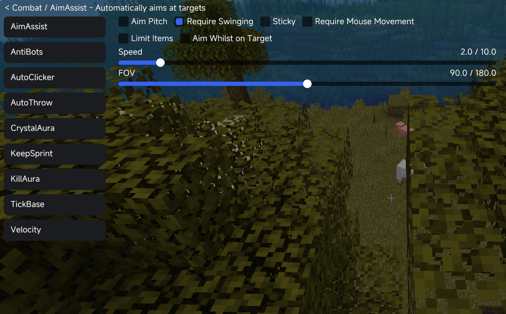
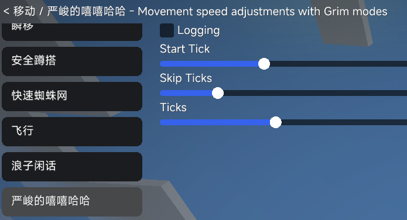
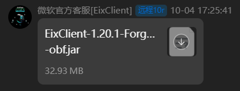

## 1. 下载安装EixClient

> 请注意：我写EixClient的汉化**不代表我推荐此客户端**，也不代表我知道此客户端会产生的问题。我写这篇文章的原因只是因为我看到了这个：  
>   
> 只汉化功能名称不汉化介绍和设置的来了。

本客户端可以从以下的群号下载。  
注意：我写下群号不代表我喜欢作者的为人，也不代表我支持其行为。不站队。  
> Eixfun①群:1108812843(已满)  
> Eixfun②群:1127095718  
群文件中有EixClient文件夹，其中有客户端文件（模组形式）。  
  
  
我们需要先安装一个1.20.1，Forge版本的客户端。  
安装后直接将其放入模组目录即可（这一步应该不用赘述了，拖入PCL模组界面或直接放入mods目录）。

接下来即可启动游戏。  
由于客户端主要支持的是布吉岛服务器，并且据说使用正版会出现进不去服务器的情况，因此不推荐使用正版登录。

## 2.进入游戏

在加载游戏时会出现奇异日语，而且如果声音开的比较大的话会比较响。建议进入前先降低音量。  
进入游戏后，客户设置端界面需要修改键位才能打开（我自己测试时发现启动键位并不是右Shift），且本客户端不支持.help唤出指令索引界面。  
我们需要先在聊天框中打出`.bind clickgui m`。其中m可以是其他任何按键（似乎不支持rshift和rightshift这种打法，但是支持insert、fN、tab等其他按键）  
接下来可以按下相对应的按键（如m）打开客户设置端界面。  
  
这是界面的样子。如果不会英语可以点击眼睛图标的"Render"，并找到ClickGUI项，右键，其中有一个Language语言选项，可以调节成中文。  
  
但是由于这个中文只汉化了20%而且极度诡异，因此以下内容全是我的翻译以及解释：

## 3. 客户端汉化

### 3.1 Combat功能汉化

  
界面展示如上图。

#### 3.1.0 吐槽

本客户端的所有功能文本全部硬编码在.class里，因此对汉化造成了一定的困难。  
虽然有"中英切换"那个功能，可惜中文只翻译了模块名（机器翻译导致其英文生僻且诡异），模块说明和全部设置项都还是英文。  
而且你们谁能绷住这个中文翻译为"严峻的嘻嘻哈哈"的GrimSpeed  
  
而且本客户端的模块**并非自动扫描注册**，而是在`ModuleManager.initModules()`里**固定**写了一个73个类的列表，但是jar里实际存在**79个**带`@ModuleInfo`注解的模块类。但出于善意，我也顺便翻译了那六个没被注册的模块（实际上不会显示也不会被加载），分别为：AutoHeal、NoFall、Speed、GrimSpeed、Particles、Test。

本客户端更新的速度之惊人令人难以想象。但是我准备开始翻译(18:58)到我翻译完成(21:27)的两个半小时内，本客户端已经从6.5迅速更新到了8.0，因此本文档**仅用于参考，不代表其为最新翻译**。  
  
(来自2026/10/4 18:26，本客户端已经更新到了9.3版本。令人蒙古的是**本客户端从6.5到9.3一共只更新了六个配置项**，而且仅是DynamicIsland灵动岛、WaterMark水印、Scaffold自动搭路。)

#### 3.1.1 AimAssist

功能介绍：Automatically aims at targets，即自动瞄准目标。  
AimPitch：自动瞄准目标的俯仰角度（即上下瞄准，如果不开启那么将只会横向瞄准）。  
RequireSwinging：指是否进行挥手动作。  
Sticky：粘性。指持续瞄准且不丢失目标。  
RequireMouseMovement：需要鼠标有移动才启动瞄准，减少检测几率。  
LimitItems：限定生效物品。按理说是只在手持剑时才启动瞄准。  
AimWhilstOnTarget：指的是"Whilst"是一个比较少见的说法，但仍可以按照while之类的翻译。  
- OnTargetSpeed：在瞄准目标时的速度（听起来有点诡异）。  
Speed：指的是瞄准速度，速度越大瞄准到的时间越短，越容易被检测。  
FOV：指的是视角范围，即只有目标进入这个范围才会进行攻击。单位为度。最大为180而不是360的原因是这个视角是向左右延伸的，因此扫全部360就是180度。

#### 3.1.2 AntiBots

功能介绍：Prevents bots from attacking you，如果直接翻译指的就是“防止机器人攻击你”，但大多数客户端的AntiBot指的都是防止服务器反作弊的杀戮光环假人检测。  
RespawnTime：假人的重生时间（理论指的是服务端假人重生时间远短于真实玩家，所以用它做时间阈值来区分真人和假人）

#### 3.1.3 AutoClicker

功能介绍：Automatically clicks for you，即自动点击。  
ItemCheck：物品检查，应该是食物相关的（但是自动点击并不作用于右键）  
MinCPS：最小点击频率。  
MaxCPS：最大点击频率。  
(由于神秘原因，*本客户端的MaxCPS可以小于MinCPS*，但没看出来出现什么报错)  
本自动点击仅限于左键操作，右键放置方块与使用食物无效。

#### 3.1.4 AutoThrow

功能介绍：Automatically throw snowballs and eggs，即自动扔出雪球/鸡蛋。  
MinDistance：最小距离。  
MaxDistance：最大距离。  
(这两个距离和刚才的CPS一样，同样可以最小距离大于最大距离，仍然没有什么报错)  
Delay：每次扔出的间隔，由于调整范围为500~2000所以我们可以合理猜测单位为毫秒。

#### 3.1.5 CrystalAura

功能介绍：Automatically attacks end crystals，即自动攻击末影水晶。  
本功能无设置。

#### 3.1.6 KeepSprint

功能介绍：Maintain a sprinting state while attacking，即在攻击时保持冲刺状态。  
本功能无设置。

#### 3.1.7 KillAura

功能介绍：Automatically attacks entities，即自动攻击实体。  
1.9Mode：指攻击带有冷却的情况。布吉岛无攻击冷却，因此不用开。（1.9Mode与CPS不共存）  
SprintReset：疾跑重置，对于Combo连击有利。  
RaycastCheck：直接翻译的话指的是射线检测，应该指的是是否需要处于视线范围内。开启则不会穿墙瞄准。  
AimRange：瞄准范围。  
CPS：攻击频率。  
RotationSpeed：转头速度。  
FOV：目标所需要进入的视角范围。  
Drift：转头偏移，即不瞄准目标中心防止检测。  
Jitter：抖动偏移，即在瞄准目标中心周围随机运动，防止被检测。  
Reach：攻击距离（3.0~4.5是什么诡异调整范围）  
SprintResetChance：疾跑重置概率。

#### 3.1.8 TickBase

功能介绍：Manipulates client ticks for combat timing，机械翻译的话就成了"调整客户端的tick，用于战斗时的定时器"，实际上指的是逐帧模拟玩家未来的位置变化，当敌人进入设定范围内时能够更早命中敌人。  
Debug：调试模式，开启后会在聊天框中应该会显示当前模拟的玩家位置。  
Range：模拟范围。  
模式枚举有三种：`REDUCING`（减速，拖慢客户端tick）、`BASING`（配平，补回多扣的tick）、`NONE`（关闭）。非可配置项。

#### 3.1.9 Velocity

功能介绍：Reduces knockback，即减少击退。  
Mode：模式，以下为各种模式：  
- Legit：合法模式，其实指的就是跳跃重置。  
  JumpWindow：跳跃窗口，单位为毫秒。  
  （这个就抽象了，我从来没见过有人把跳跃窗口期这么翻译的）  
- Reduce：减少击退模式。  
  Horizonal：横向减少击退。  
  Vertical：纵向减少击退。  
- NoXZ：无X和Z轴（横向）击退模式。  
  AttackCounts：攻击次数，单位为次。  
  MaxAlinkTime (ms)：不知道什么意思，大概指的是击退时间，单位为毫秒。  
  （根据本客户端自己说。本设置来自于NavenAlpha。因此他也不知道什么意思。）  
    
  阶段枚举`VelocityStage`有五种：`NONE`（无）、`DELAY`（延迟）、`ATTACK`（攻击）、`CLEAR`（清除）、`LAG`（丢包）。非可配置项。

### 3.2 Movement功能汉化

#### 3.2.1 AutoStuck

功能介绍：Automatically enable stuck when you over void，即在坠入虚空时自动开启Stuck滞空功能。  
FallDistance：指掉落了多少高度时开启Stuck

#### 3.2.2 Blink

功能介绍：Suspends all movement packets for teleporting，即为了在别人眼中看起来像传送，在你开启功能时停止发送所有移动包（开启时间过长理论会被检测）。  
ReleaseTicksOnDamage：在受到伤害时释放移动包。  
ReleaseSpeed(Tick)：释放速度。  
MaxTicks：最多积攒多少tick（1gt游戏刻 = 0.05秒）  
PlayerDistance：玩家距离，单位为米，应该指的是距离多少米之内后释放移动包。  
TNTDistance：TNT距离，单位为米，应该指的是距离多少米之内后释放移动包。  
FakePlayerHitBoxes：伪造玩家碰撞箱。让你在被挂起的状态下，在别人客户端里依然保有碰撞体积（不知意义）。  
（界面会显示​N Ticks Behind​，即"落后N刻"，用来显示当前挂起了多久。）

#### 3.2.3 Eagle

功能介绍：Legit trick to build faster. Auto-sneak near edges，即靠近边缘时自动潜行。  
MinDelay(Ticks)：潜行动作与实际放置之间的最小延迟。  
MaxDelay(Ticks)：最大延迟。。  
OnlyBackwards：仅在后退时生效。  
OnlyWithBlocks：仅在脚下已经有方块（按理说是手中有方块）时才生效。  
FastPlace：快速放置。  
CPS：快速放置的频率。

#### 3.2.4 FastWeb

功能介绍：Allows you to walk faster on cobwebs，即让你在蜘蛛网中移动得更快。  
Ground Multiplier：地面移动倍率。蜘蛛网上的移动速度 = 地面移动速度 × 倍率。

#### 3.2.5 Fly

功能介绍：Double-tap space to fly like creative mode，即双击空格像创造模式一样飞行。  
Speed：飞行速度。

#### 3.2.6 GrimFly

功能介绍：Attempts to desync brief keepalive timing after knockback，即尝试在受到击退后短暂让心跳包（KeepAlive）的时序错位。  
（原理是受击退时你的移动包会乱序到达，如果此时心跳包也错位，服务器就难以判断你到底在哪里，进而绕过Grim。）  
本功能无设置。

#### 3.2.7 GrimLowHop

功能介绍：Movement speed adjustments with Grim modes，即适用于Grim的跳跃高度修改。  
Logging：启用日志输出。  
Start Tick：起始的tick。  
Ticks：持续多少tick。  
Skip Ticks：跳过多少tick。

#### 3.2.8 GrimSpeed

功能介绍：Movement speed adjustments with Grim modes，即适用于Grim的移动速度调整。  
Logging：启用日志输出。  
Fast Fall：快速下落。  
Fast Fall On 1 Tick / On 2 Tick / On 3 Tick / On 4 Tick / On 5 Tick：在第N个tick时触发快速下落。也就是在往下掉1格的那个瞬间加速。  
Start Fast Fall：开始快速下落的时间。  
Packet Count：发包数量。  
Skip Ticks：跳过多少tick。  
Ticks：持续多少tick。  
Rotation：转头。  
Speed：速度。  
调试输出里的`Air ticks:`：即"空中tick数"。

#### 3.2.9 LongJump

功能介绍：Allows you to use fireball longjump，即让你可以用火球打出"跳远"位移。  
原理是：连续点燃TNT引爆火球拿到击退冲量 → 用类似Blink的方式挂起移动包 → 每积累一个火球的击退就释放一次，从而连续位移。  
本功能无设置，全部交互均靠鼠标侧键完成。以下为界面提示：

- `§cNo FireBall!`：你没有火球！  
- `§aLongJump enabled! Press Mouse4 to jump & use fireball, Mouse5 to release each knockback`：跳远已开启！按鼠标4跳跃并使用火球，鼠标5逐个释放击退。  
- `§eStarting fireball usage #X`：开始使用第X个火球。  
- `§aAll released! Stopping LongJump.`：全部释放完毕！停止跳远。  
- `§cNo intercepted packets`：没有已拦截的数据包。  
- `§cAll already released`：已经全部释放了。  
- `§aUsing fireball #X`：正在使用第X个火球。  
- `§bWaiting for input | Mouse4: Jump & use fireball | Mouse5: Release`：等待输入 | 鼠标4：跳跃并使用火球 | 鼠标5：释放。  
- `§aJumping for fireball #X`：为第X个火球起跳。  
- `§eFireball #X started, initial count: Y`：第X个火球已开始，初始数量：Y。  
- `§eFireball #X used! Count: Y -> Z, waiting for next input`：第X个火球已使用！数量：Y → Z，等待下一次输入。  
- `§cNo more fireballs available!`：你没有更多可用的火球了！  
- `§ePacket interception started, press Mouse5 to release each`：数据包拦截已开始，按 鼠标5 逐个释放。  
- `§eReceived #X, starting packet interception`：已收到X个，开始拦截数据包。

#### 3.2.10 NoFall

功能介绍：Prevents fall damage，即免疫摔落伤害。  
FallDistance Mode：坠落距离模式，决定按什么标准触发。  
FallDistance：坠落距离阈值。  
Calc：计算模式。  
Custom：自定义模式。  
Rotation Speed：转头速度。  
Retrieve Water：自动收回水桶（MLG）。落地的时候把用来垫伤害的水桶收回背包。

#### 3.2.11 NoJumpDelay

功能介绍：Removes the delay when jumping，即去起跳延迟。  
本功能无设置。

#### 3.2.12 NoSlow

功能介绍：NoSlowDown，即使用物品不减速。  
Mode：模式。  
None：空模式。  
Food：仅对食物生效。  
Bow：仅对弓生效。  
Crossbow：仅对弩生效。  
Jump：跳跃时取消减速。  
Grim50%：适用于Grim的抵消50%减速。  
Grim 1/3：适用于Grim的抵消1/3减速。  
Heypixel 2/3：适用于布吉岛的抵消2/3减速。

#### 3.2.13 SafeWalk

功能介绍：Prevents you from falling off blocks，即防止从方块边缘掉下去。  
本功能无设置。

#### 3.2.14 Scaffold

功能介绍：Automatically places blocks under you，即自动在脚下放置方块。  
Telly：Telly。（指的是Telly法搭路。）  
Snap：吸附。转头时吸附到方块正中心。  
Telly Ticks：Telly的间隔tick数。  
Normal：普通模式。  
Click：点击模式。靠模拟点击来放置方块。  
> Human Extra Place：拟人额外放置。模仿真人会多放一个方块的行为。  
> Human Up Place：拟人向上放置。模仿真人向上搭的行为。  
> Server Side Rotation：仅服务端转头，客户端本地看不到。  
> Place Delay：放置延迟。  
> （以上四项在新版本中被删除）  
Rotation Speed：转头速度。  
Rotation Back Speed：回正转头速度。放完之后把视角转回正前方的速度。  
SafeWalk：联动安全行走模块。  
ESP：渲染方块。

#### 3.2.15 Speed

功能介绍：Movement speed adjustments with Grim modes，即带Grim模式的移动速度调整。  
Bounding Box Size：碰撞箱大小。改自己的碰撞箱来穿过窄缝或者卡进方块（这个调整范围看着很大，慎用）。  
In Player Speed：玩家内速度。即只在周围有玩家的区域生效的速度，这样单人跑图时不会触发反作弊。  
Fast Fall：快速下落。  
Move Flying Increase：创造飞行加速。

#### 3.2.16 Sprint

功能介绍：Automatically sprints，即自动疾跑。  
本功能无设置。

#### 3.2.17 Stuck

功能介绍：Stuck in air!，即滞空。用来在特定位置卡住自己。  
本功能无设置。

### 3.3 Render功能汉化

#### 3.3.1 Animations

功能介绍：Customizes item animations and block animations，即自定义手持物品动画与方块动画。  
Block Mods：格挡动画修改（这少了个e吧，Modes）。  
None：无模式。  
Push：推动样。  
Aura Auto Block：杀戮光环自动格挡。  
Only Aura：仅光环。只在KillAura开启时生效。  
Blocking-X：格挡X偏移。举盾时的横向位移。  
Blocking-Y：格挡Y偏移。举盾时的纵向位移。

#### 3.3.2 AntiBlindness

功能介绍：Prevents blindness，即免疫失明效果。  
本功能无设置。

#### 3.3.3 AntiNausea

功能介绍：Prevents nausea，即免疫反胃效果。  
本功能无设置。

#### 3.3.4 ArrayList

功能介绍：显示你打开的模块。（该介绍原本就是中文）  
Pretty Module Name：美化模块名。  
Hide Render Modules：隐藏渲染类模块。  
Sync Color：颜色同步。  
Speed：调整变色速度。  
ArrayList Size：设置列表大小。

#### 3.3.5 BedESP

功能介绍：Highlights beds，即高亮显示床。  
本功能无设置。

#### 3.3.6 ChestESP

功能介绍：Highlights chests，即高亮显示箱子。  
本功能无设置。

#### 3.3.7 ClickGUI

功能介绍：The ClickGUI，即模块设置菜单。  
Language：语言。（原模组的选项是`English` / `中文`，这个不用翻）  
Style：样式。  
（原模组把ClickGUI翻译成了"点击用户图形界面"。）

#### 3.3.8 Compass

功能介绍：Shows a compass，即显示指南针。  
Compass Only：仅显示指南针。  
No Player Only：不显示玩家（？）。

#### 3.3.9 DynamicIsland

（无功能介绍）  
- Island：灵动岛样式（圆角矩形）。**9.3新增**。  
- Capsule：胶囊样式。**9.3新增**。  
即屏幕顶部的灵动岛，用来显示击杀播报、歌词、FPS、玩家数等。  
Bloom：泛光。  
Blur：模糊。  
Radius：圆角半径。  
YOffset：Y轴偏移。  
Music Island：音乐灵动岛。  
Music Layout：音乐布局。  
Lyrics：歌词显示。  
Lyric Translation：歌词翻译。  
Next Lyric Line：下一行歌词。  
Music Max Width：音乐区最大宽度。  
Music Progress Bar：音乐进度条。  
Full：完整版。  
提示文本：

- `You killed X !`：你击杀了X！  
- `Victory!` / `胜利` / `获胜` / `you win`：胜利！  
- `FPS: `：帧率：  
- `Players: `：玩家数：

#### 3.3.10 EffectHUD

功能介绍：Displays potion effects on the HUD，即在HUD上显示药水效果。  
Position：位置。

#### 3.3.11 Fov

功能介绍：Change fov.，即修改视野范围。  
Fov：视场角。

#### 3.3.12 FullBright

功能介绍：Make your world brighter，即夜视效果。  
Brightness：亮度调节。

#### 3.3.13 Glow

功能介绍：Glow effect for entities，即让实体产生发光轮廓。  
Player：玩家。  
Items：物品。  
Mobs：生物。  
Animals：动物。  
Arrows：箭矢。

#### 3.3.14 HUD

功能介绍：Displays information on your screen，即在屏幕上显示各类信息。  
（原模组把HUD翻译成了"抬头显示器"）  
Module Toggle Sound：模块开关音效。  
Red 1 / Green 1 / Blue 1：主色的红/绿/蓝分量。  
Red 2 / Green 2 / Blue 2：辅色的红/绿/蓝分量。  
Chat Background：聊天背景。  
Chat Blur：聊天背景模糊。  
Chat Shadow：聊天阴影。  
Chat Radius：聊天框圆角半径。  
Chat Input Background：聊天输入框背景。  
Better GUI：更好的容器界面（即箱子、工作台这些界面的美化）。  
Better GUI Blur：容器界面模糊。  
Better GUI Radius：容器界面圆角半径。  
Better GUI Shadow：容器界面阴影。  
Better GUI Opacity：容器界面不透明度。  
Better GUI Slot Opacity：容器格子的不透明度。

#### 3.3.15 HUDEditor

功能介绍：HUD editor screen.，即信息栏编辑界面。  
本功能无设置。

#### 3.3.16 ItemTags

功能介绍：Show item tags.，即给物品加上名称标签。  
Scale：缩放。  
All Items：所有物品。  
God Items：神器（如秒人斧，水晶之类。适用于空岛）。  
Gold：金。  
Diamond：钻石。  
Iron：铁。  
Golden Apple：金苹果。  
Ender Pearl：末影珍珠。  
Useful Item：有用的物品。

#### 3.3.17 KeyBinds

功能介绍：显示所有按键绑定。（该条原模组已是中文）  
Position：位置。  
Style：样式。  
Style A：样式A。  
Style B：样式B。  
KeyBinds Size：显示大小。  
Key Bind：按键绑定。  
Key Binds：按键显示。  
NONE：无。（未绑定的按键显示这个）  
M：中键。

#### 3.3.18 MotionBlur

功能介绍：Make your game smoother.，即营造动态模糊的顺滑观感。  
Strength：强度。  
本模块需要光影支持，开关名为`shaders/post/motion_blur.json`。

#### 3.3.19 NameProtect

功能介绍：Protect your name，即隐藏或伪装你自己的名字。  
本功能无设置。原模组里的`§dAlpha§7`是示例文本。

#### 3.3.20 NameTags

功能介绍：Renders name tags，即渲染玩家头顶的名称标签。  
Scale：缩放。  
Blur：模糊。  
Bloom：泛光。  
（内部还有`Team`（队友）和`Friend`（好友）两个着色分支，用来给不同关系的人上不同颜色）  
（`CIT-`指Citizens服务器插件的假人。不显示。）

#### 3.3.21 NoHurtCam

功能介绍：Disables the hurt camera effect，即关闭受伤时的镜头抖动。  
本功能无设置。

#### 3.3.22 NoRender

功能介绍：Disables rendering，即关闭部分内容的渲染。  
Disable Effects：禁用粒子/音效等特效。

#### 3.3.23 Notification

（无功能介绍）  
即屏幕角落弹出的提示气泡。  
Position：位置。

#### 3.3.24 Particles

功能介绍：Renders world particles，即渲染粒子特效。  
Mode：模式，决定用哪种粒子。  
Off：关闭。  
FireFlies：萤火虫。  
FFCount：萤火虫数量。  
FFSize：萤火虫大小。  
SnowFlake：雪花。  
Stars：星星。  
Hearts：爱心。  
Dollars：美元符号。  
Count：数量。  
Size：大小。  
Physics：物理运动方式。  
Fly：飞（？）。  
Drop：水滴。  
Sync Color：颜色同步。  
Color Speed：变色速度。  
Bloom：泛光或者樱花效果？。

#### 3.3.25 PostProcess

功能介绍：Post process effects，即画面后处理特效。  
FastBlur：快速模糊。  
Blur FPS：模糊的最大帧率限制。  
Blur Strength：模糊强度。  
Glow：泛光。

#### 3.3.26 Projectiles

功能介绍：Renders projectiles，即显示投掷物的飞行轨迹和落点。  
Show Arrows：显示箭矢。  
Show Pearls：显示末影珍珠。  
Show Potions：显示药水。  
Show Eggs：显示鸡蛋。  
Show Snowballs：显示雪球。

#### 3.3.27 Scoreboard

功能介绍：Modifies the scoreboard，即修改右侧的计分板。  
Hide Red Score：隐藏红色的分数（即右侧数字）。  
Font：字体。  
X Offset：X轴偏移。  
Down：向下排列。  
Position：位置。

#### 3.3.28 ServerNameSpoof

功能介绍：Spoof the server name，即伪造显示的服务器名称。  
本功能无设置，固定伪造为`§e2b2t.gg`和"布吉岛"。。

#### 3.3.29 TargetESP

功能介绍：Render face overlay，即在目标头顶渲染图案。  
Mode：模式。  
Rectangle：矩形框。  
Face：头像。  
Image：图片。  
Size：尺寸。  
Hurt：受伤高亮。  
（模式里的`于哲`、`李丹`、`于思礼`来自模组内置`yuzhe/yuzhe.jpg`、`yuzhe/lidan.png`、`yuzhe/ysl.png`。再次说明本人不站队。）

#### 3.3.30 TargetHUD

功能介绍：Display target info.，即显示当前目标的信息。  
Position：位置。  
HurtFlash：受伤闪烁。  
ShowAbsorption：显示伤害吸收值（即金苹果提供的额外血量）。

#### 3.3.31 Test

（无功能介绍）  
开发用测试模块。  
Position：位置。

#### 3.3.32 TimeChanger

功能介绍：Change the time of the world，即修改世界时间。  
World Time：世界时间。

#### 3.3.33 ViewClip

功能介绍：Allows you to see through blocks，即让你能看穿方块（太长时间了不知道是干什么用的了。）。  
Scale：缩放。  
Animation：动画。  
Animation Speed：动画速度。

#### 3.3.34 Watermark

（无功能介绍）  
即屏幕角落的客户端水印。  
Hue Shift：色相偏移。**9.3新增**，取代了6.5的`Sync Color`。  
Solid White：纯白。**9.3新增**。  
Sync Color：颜色同步。（已被删除）  
Speed：速度。  
Position：位置。  
Alpha：不透明度。

#### 3.3.35 Weather

功能介绍：Customize world weather，即自定义天气。  
Mode：模式。  
Rain：下雨。  
Clear：晴天。  
Snow：下雪。

### 3.4 Misc功能汉化

#### 3.4.1 AntiFireball

功能介绍：Prevents fireballs from damaging you，自动打回烈焰弹。  
本功能无设置。

#### 3.4.2 AutoHeypixel

功能介绍：Auto play Heypixel server.，即自动游玩布吉岛服务器。  
Auto Screenshot：自动截图。  
Auto Play：自动游玩。

#### 3.4.3 AutoSoup

功能介绍：Automatically uses mushroom stew when health is low，即血量低时自动使用蘑菇煲。  
本功能无设置。

#### 3.4.4 AutoTools

功能介绍：Automatically switches to the best tool for the job，即自动切换到当前最合适的工具。  
Check Sword：检查是否手持剑。  
Switch Back：是否切回原物品。用完之后把视角物品切回之前那个。  
Silent：静默切换。不让物品在手上有停留帧，直接换到副手。

#### 3.4.5 ChestStealer

功能介绍：Automatically steals items from chests，即自动把箱子里的东西捡进背包。  
Min Delay (Ticks)：最小延迟（tick）。  
Max Delay (Ticks)：最大延迟（tick）。  
Ender Chest：末影箱。  
提示`No pearls found.`即"没找到末影珍珠"。

#### 3.4.6 ClientFriend

功能介绍：Treat other users as friend!，即把其他玩家标记为好友（不触发PvP）。  
本功能无设置。

#### 3.4.7 EffectTags

功能介绍：Show the player's effect tags.，即显示玩家身上的药水效果。  
Debug：调试模式，会额外显示坐标和tick（输出`X: `、`Y: `、`Z: `、`Ticks: `）。  
Shared：共享。与队友共享标记。

#### 3.4.8 FastPlace

功能介绍：Place blocks faster，即更快地放置方块。  
CPS：每秒放置次数。

#### 3.4.9 GhostBedMine

功能介绍：Mines beds through walls，即隔墙放置或拆除床。  
本功能无设置。

#### 3.4.10 GhostChestOpen

功能介绍：Opens containers through walls，即隔墙打开箱子、潜影盒等容器。  
本功能无设置。

#### 3.4.11 GhostHand

功能介绍：Allows interacting with blocks through walls，即允许隔着墙对方块进行交互，鬼手。  
（原模组翻译为"鬼头"。）  
本功能无设置。

#### 3.4.12 Helper

功能介绍：Bed wars Info helper，即起床战争信息提示助手。  
本功能无设置，全部是聊天框播报：

- `第X波钻石刷新`：第X波钻石刷新。  
- `第X波绿宝石刷新`：第X波绿宝石刷新。  
- `游戏准备开始`：游戏准备开始。  
- `游戏结束`：游戏结束。

#### 3.4.13 InventoryManager

功能介绍：Automatically manage your inventory，即自动整理与管理你的背包。  
（这个模块的设置项最多，一共40多项。）  
报错`Duplicate slot config in Inventory Manager! Please check your config!`即"背包管理器中槽位配置重复！请检查你的配置！"

- 通用类：  
  - Min Delay (Ticks)：最小延迟（tick）。  
  - Max Delay (Ticks)：最大延迟（tick）。  
  - Offhand Items：副手物品。  
  - Auto Armor：自动穿甲。  
  - Inventory Only：仅整理背包（不去动装备栏）。  
  - Throw Items：丢弃无用物品。  
- 方块类：  
  - Switch Block：切换方块。  
  - Block Slot：方块槽位。  
  - Max Block Size：最大方块堆叠数。  
- 镐/斧类：  
  - Switch Pickaxe：切换镐。  
  - Pickaxe Slot：镐槽位。  
  - Switch Axe：切换斧。  
  - Axe Slot：斧槽位。  
- 弓弩类：  
  - Switch Bow or Crossbow：切换弓或弩。  
  - Bow Slot：弓槽位。  
  - Bow Priority：弓的优先度。  
  - Max Arrow Size：最大箭矢数量。  
  - Power Bow：力量弓。  
  - Punch Bow：击退弓。  
- 消耗品类：  
  - Switch Water Bucket：切换水桶。  
  - Water Bucket Slot：水桶槽位。  
  - Switch Ender Pearl：切换末影珍珠。  
  - Ender Pearl Slot：末影珍珠槽位。  
  - Switch Fireball：切换火球。  
  - Fireball Slot：火球槽位。  
  - Switch Golden Apple：切换金苹果。  
  - Golden Apple Slot：金苹果槽位。  
  - Switch Eggs & Snowballs：切换鸡蛋和雪球。  
  - Eggs & Snowballs Slot：鸡蛋/雪球槽位。  
  - Max Eggs & Snowballs Size：鸡蛋/雪球最大堆叠数。  
  - Switch Rod：切换鱼竿。  
  - Rod Slot：鱼竿槽位。  
  - Keep Water Buckets：保留水桶。  
  - Keep Lava Buckets：保留岩浆桶。  
  - Keep Eggs & Snowballs：保留鸡蛋和雪球。  
- 武器类：  
  - Switch Sword：切换剑。  
  - Sword Slot：剑槽位。  
  - Check Sword：检查是否手持剑。

#### 3.4.14 Middle Click

（无功能介绍）  
用鼠标中键把准星指向的玩家加/移出好友名单。

- `Added X as friends!`：已将X加为好友！  
- `Removed X from friends!`：已将X移出好友！  
- `No pearls found.`：没找到末影珍珠。

#### 3.4.15 MusicPlayer

功能介绍：播放本地音乐文件 (MP3 / OGG / WAV / AIFF)。（该条原模组已是中文）  
（这个模块是全客户端汉化最完整的部分（因为压根不是Eixfun写的而是吴博涵写的），界面提示基本都是中文了，剩下没翻的就是下面这些设置项）

- Show HUD：显示HUD。  
- HUD Style：HUD样式。  
  - Compact：紧凑。  
  - Full：完整。  
- Background：显示背景。  
- Progress Bar：显示进度条。  
- Equalizer Icon：显示均衡器图标。  
- Show Time：显示时间。  
- Volume：音量。  
- Loop Mode：循环模式。  
  - Off：关闭。  
  - One：单曲循环。  
  - All：列表循环。  
  - Shuffle：随机播放。  
- Music Folder：音乐文件夹。  
- Position：位置。  
- Netease Sync：网易云同步。  
- SMTC Sync：系统媒体同步。（读取Windows的SMTC接口，能识别AIMP、foobar2000、PotPlayer、VLC等播放器的信息）  
- Other Players：读取其他播放器。  
- Fetch Lyrics：获取歌词。  
- Lyric Offset (ms)：歌词偏移（毫秒）。  
- Next Key：下一首按键。  
- Previous Key：上一首按键。  
- Volume Up Key：音量+按键。  
- Volume Down Key：音量-按键。  
- Playlist Key：播放列表按键。

#### 3.4.16 Target

功能介绍：Prevent attack teammates，机翻是防止攻击队友，实际上是调整目标范围。  
Player：玩家。  
Invisibles：隐身玩家。  
Animals：动物。  
Mobs：生物。  
Villager：村民。

#### 3.4.17 Teams

功能介绍：Prevent attack teammates，即防止攻击队友。  
Mode：模式。  
Color：按颜色区分。  
Scoreboard：按计分板区分。

（剩下的没打完，明天继续翻译）
