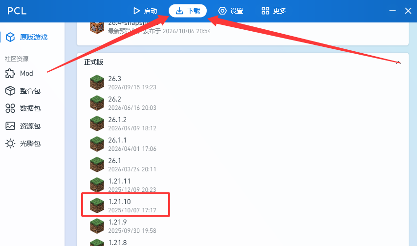
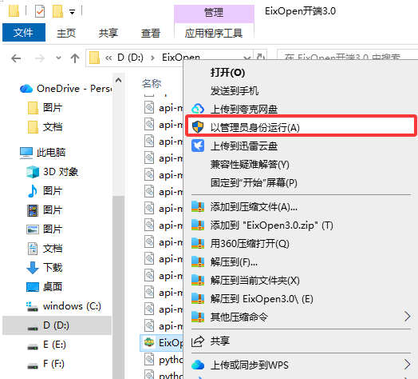
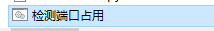
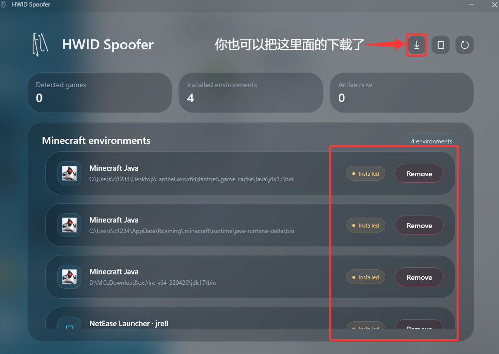
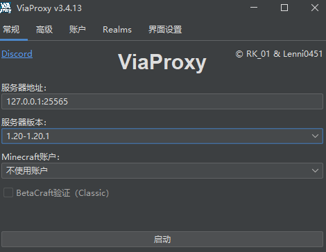
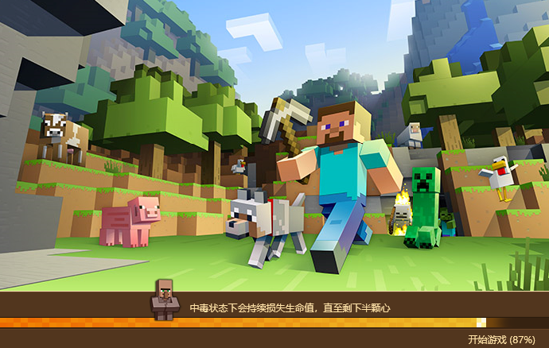
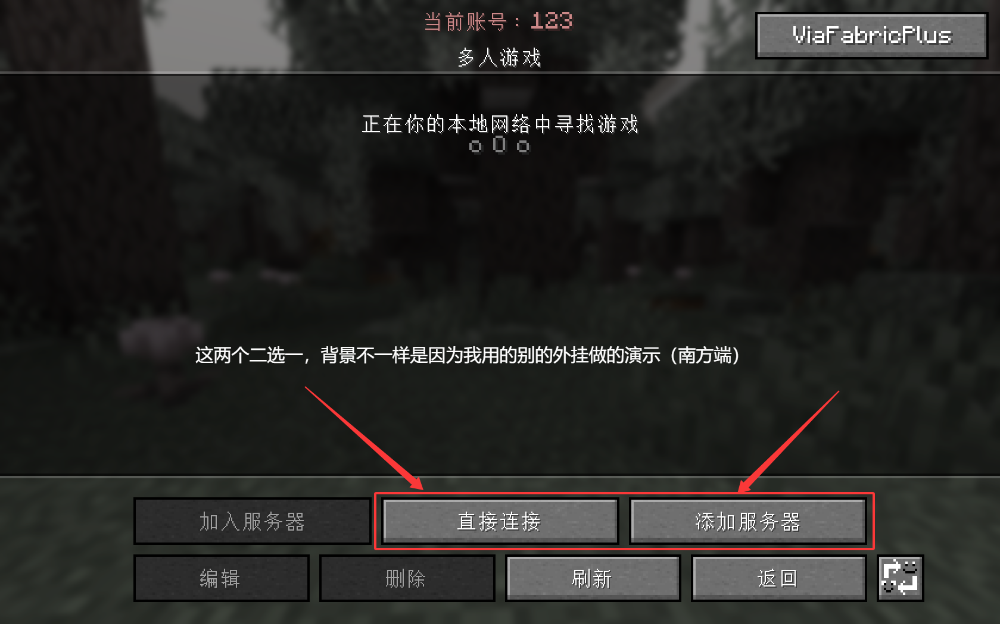
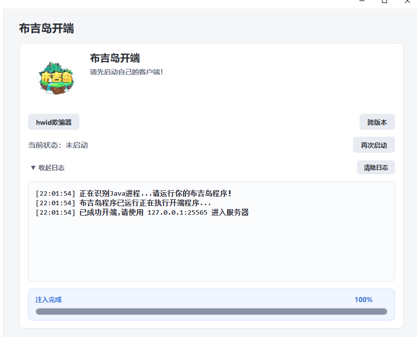

## 使用教程（部分地方可能不详细）：

首先需要准备一个PCL（或者其他第三方启动器HMCL等）  
之后安装MOD（即外挂，也就是群文件里面的eix客户端里面的那个文件，当然你有别的也能换成别的  
(MOD要和版本对应！文件的后面就是【群内的端需要1.21.10-NeoForge版本】）

之后启动你的网易MC启动器（建议使用HOOK【怎样使用HOOK这里不详写了，见片尾】）和刚才准备好的带有MOD的PCL存档（怎样按照MOD去网上搜索）  
之后启动布吉岛，托盒（由于此托盒自带跨版本所以你可以不用安装Via跨版本，版本要跨到1.20-1.20.1）  
托盒使用教程：群内文件下载托盒软件，解压到文件夹内，滑到底下，右键EixOpen3.0，以管理员身份运行

之后用最下面的“检测端口占用”程序检测端口是否被占用，没有占用即可继续运行（只要按照正常操作走都是未占用状态）

打开EixOpen后，点左侧功能，先用hwid欺骗器，单击打开，点“布吉岛”右侧的蓝框（你要不放心也能全点）  

如果没有可以先启动一次布吉岛，如果无法解hwid，先退出你的布吉岛进程再点，解开后不要关，最小化（右上角的横杠）  
之后点跨版本，服务器地址写：127.0.0.1:25565，服务器版本选择1.20-1.20.1，之后启动就行，别的不用管

同理，不要关，最小化，然后在布吉岛加载时（如图界面，进度不一定100％一样）点击运行开端，成功后，日志内会提示使用127.0.0.1:25565进入服务器

之后在PCL打开的存档内，进入多人游戏，点直接连接或添加服务器，地址写127.0.0.1:25565（刚才给你的）

成功图片如下：

之后就能进入布吉岛了，里面人没皮肤，手上的东西是纸等都是正常现象，不影响游玩（你托盒进去没有布吉岛的材质包）

完

## HOOK使用  
去官网下载DLL文件和MC的下载器（官网：https://github.com/daijunhaoMinecraft/WPFLauncher_Hook/releases）  
【进不去挂个加速器】  
下载界面的下方附有使用方法以及截图，这里不详说  
（如果还不知道怎样使用/只看文字图片看不懂，请上bilibili搜索UP：Eixfun，观看其最新作品）  
（若还不会怎样使用，请花钱找人远程/找好心人免费给你安装和教程，注：非官方人员免费远程可能会安装奶酪（病毒），此为提醒，遇到自己解决）

## 最后声明

问问题前：先尝试自己解决，去网上搜索看是否有教程，最后再请教他人  
别人没有给你解决问题的义务，所以要做好无人回复的准备，不要刷屏  
（如果你什么都不做就去群里问一些LowIQ（低智商）问题，被踢/禁言/被骂只能受着）

