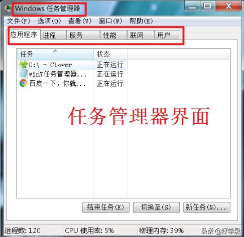
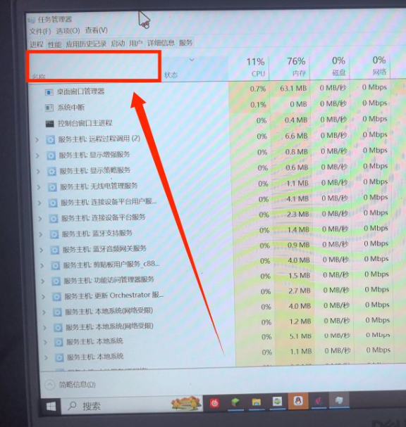

这是一篇**基础性**文章，介绍如何通过任务管理器与已经启动的进程找到进程所在位置。主要用于找那些启动了的但是位置未知的EXE文件。
**如果已经会了，可以直接跳过。**

## 1. 打开任务管理器

快捷键：Ctrl+Shift+Esc即可启动任务管理器。
三个键需要同时按下（顺序不是特别重要）
如果你是Windows11，那么你可能会看到这个界面弹出：
如果你是Windows10，那么你可能会看到这个界面弹出：
如果你是Windows7，那么你可能会看到这个界面弹出：
**中国绝大多数的个人计算机都是这三个系统其中之一**，如果无法确定，可以去设置的信息项中查找，本文章不赘述。

其实任务管理器有极多的启动方法，包括但不限于：
- 快捷键：Ctrl+Shift+Esc
- Ctrl+Alt+Del进入安全窗口，选择“任务管理器”项
- Win+R进入"运行"窗口，输入taskmgr并回车
- 在文件资源管理器上方路径栏输入taskmgr并回车
- 在开始菜单中搜索“任务管理器”，点击打开
- 右键下方任务栏，选择“任务管理器”
- 右键左下角Windows图标，找到“任务管理器”项，点击打开

## 2. 找到进程

在任务管理器中找到你想要找的进程，以下用WPFLauncher.exe为例：
- 你可以通过搜索来找到进程（仅限于Win11，Win10和Win7没有此功能）
- 你可以点击"名称"列，使其通过名称排序。前台应用一般都会被排列到上方，可以通过图标或者窗口名称找到相关进程（对于应用来说很好用，后台进程可能会麻烦一些。本方法适用于Win10/11）
- 如果是Win7就比较麻烦，因为Win7只能通过相关进程的图标和关键词找到，没有特别方便的方法。

## 3. 找到进程所在位置

右键点击进程，右键菜单中一般会出现如图所示的右键菜单
，
然后点击“打开文件所在位置”。如果你发现可以点击的项很多都是灰色无法点击的文字或者明显菜单里面的字很少，你可以尝试展开那个进程（左键）再右键点击菜单。

## 4. 完成

这样就可以找到进程所在位置了。

