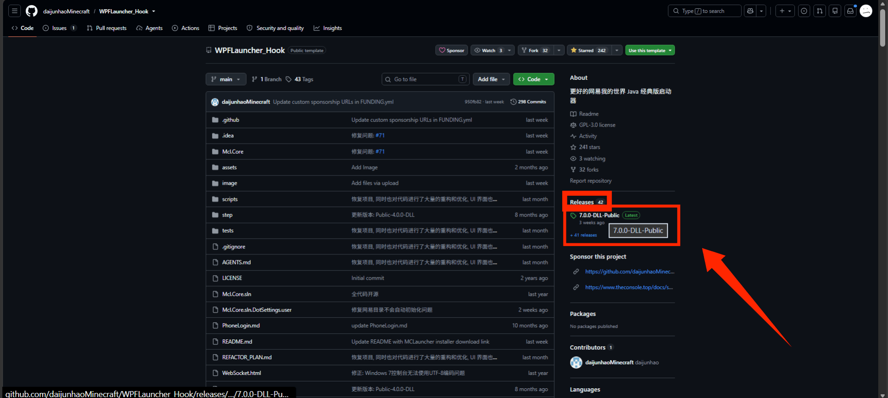
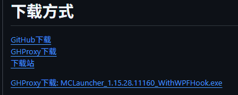
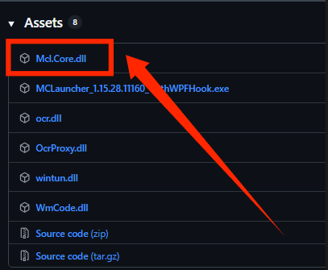
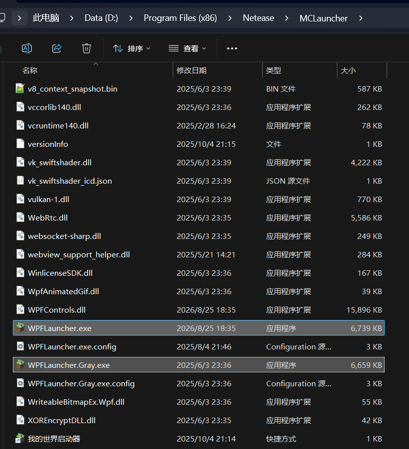
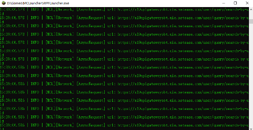
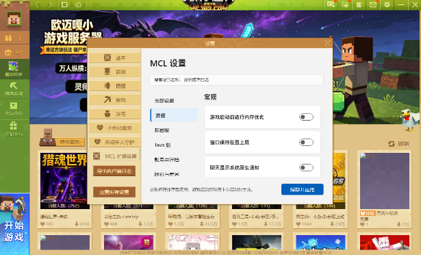
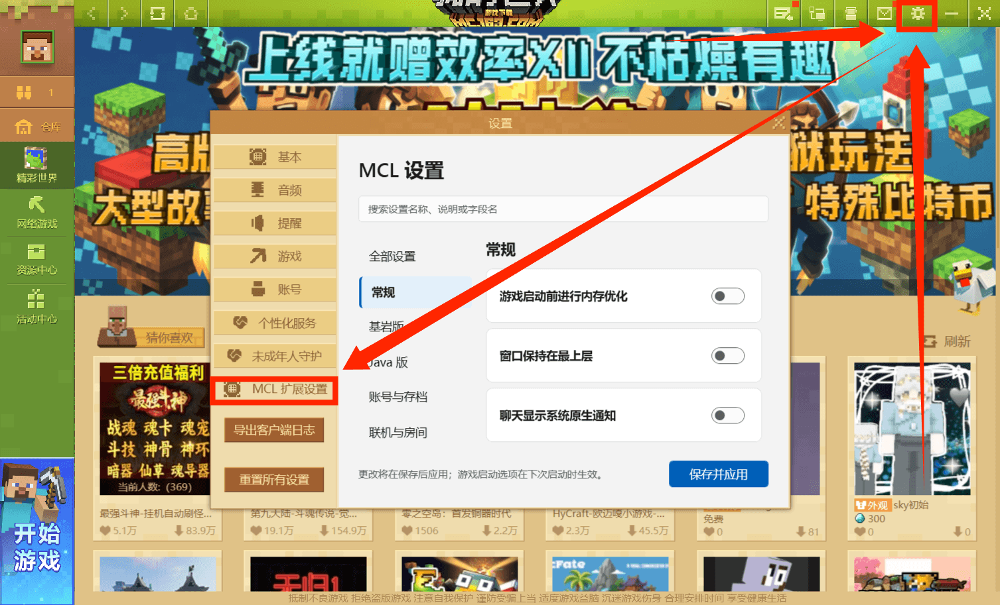
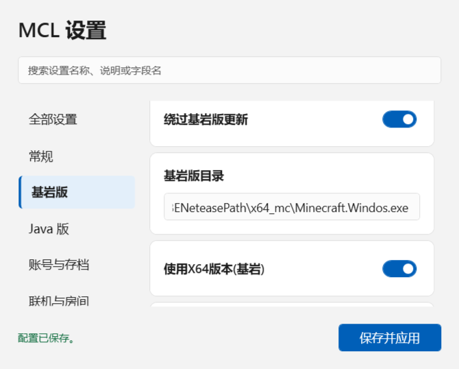
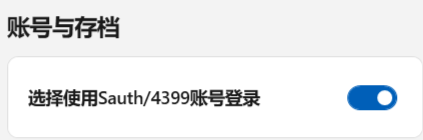
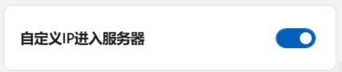

## 0. 前言

有人问安装这个有什么用，这个在之后的用处会很大，将会在其他文章有很多次引用。详情请看其他文章。

## 1. 下载和安装

### 1.1 下载

下载地址：https://github.com/daijunhaoMinecraft/WPFLauncher_Hook  
这个页面是Github的项目页面，点击“Releases”可以查看最新的版本。  
**如果进不去就是被墙了**，有梯子的可以开梯子，没梯子的可以前往作者Daijunhao自己的下载站 https://openlist.theconsole.top/openlist/share/WPFLauncher_Hook  
下载站中包含了最新的版本，直接下载即可。**注意：一定要下载最新版本**  
  
Release下方展示出来的都是最新版本。如本图所示的7.0.0-DLL-Public。  
点击进去后往下翻，可以看到有两个地方可以下载。1： 2：  
自己去找能下载的方法。最终下载下来的文件应该是一个dll文件（Mcl.Core.dll）

### 1.2 安装

下载完成后，按照前面的文章（找到进程所在位置），找到WPFLauncher所在的位置即可  
  
路径格式为D:\Program Files (x86)\Netease\MCLauncher，当然如果当时安装的时候是自定义路径，也有可能在其他地方，总之你会看到一个WPFLauncher.exe，并找到原本的Mcl.Core.dll文件。  
将下载好的Mcl.Core.dll文件复制到这个文件夹下，替换原本的文件即可。（最好保留一下原本的dll文件，因为之后可能会用到。可以改名为其他名称如Mcl.Core.Old.dll，只要自己能记住就行）  
如果自己替换时显示需要管理员权限而且重试无效，可以先重命名原本的文件，再复制新的文件。如果还不行请上网自行咨询方法（不然这篇文章的篇幅可能又要增加一半）

如果成功安装，启动时就会弹出一个黑色的窗口（命令行），类似这种。  
然后出现以下窗口说明成功了。  

## 2. 使用

### 2.1 基本使用

窗口中有多种设置。  
假如第一次启动时没有弹出设置界面，你可以前往启动器的主页面的设置界面，会有一个"MCL扩展设置"。  
  
如果保存设置时出现"更改未保存：基岩版目录：请输入有效路径。"，你需要启动一次基岩版（你可以去启动一次EaseCation基岩版，只要是网易基岩版就可以），然后在基岩版已经启动的时候再使用一次"找到进程所在位置"，将路径输入进"基岩版"-"基岩版路径"中。路径固定性很高，一般都是"X:\MCLDownload\MinecraftBENeteasePath\x64_mc\Minecraft.Windows.exe"。大多数情况下都是"x64_mc"，只有极少数情况下可能是"windowsmc"(指32位版本)。  

### 2.2 设置配置

正常玩的话不用改什么特定的配置，  
需要的话可能有：  
  
  
  
因为我并没有什么游玩经验，根据很久之前的经验猜测需要开启这些。如有错误请指正。
