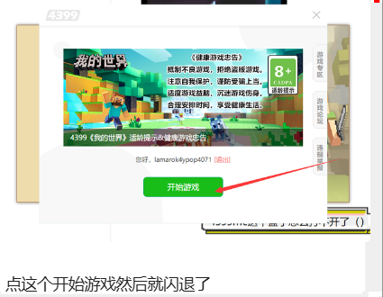
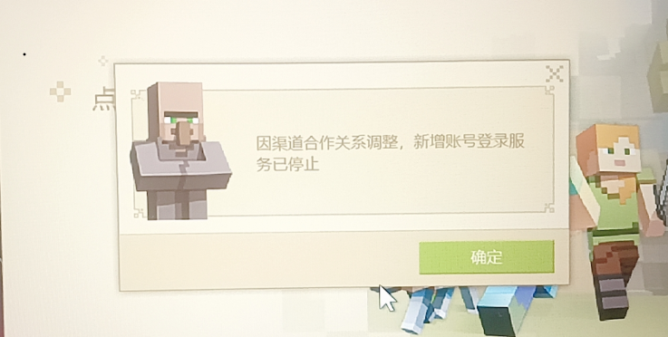
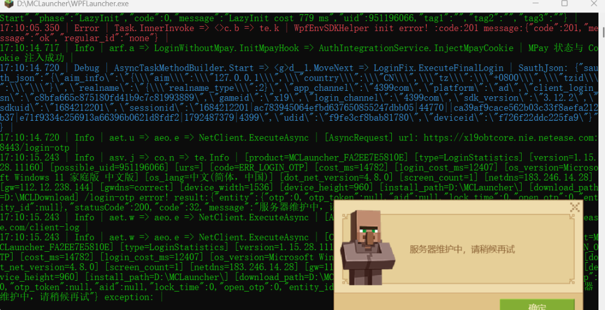
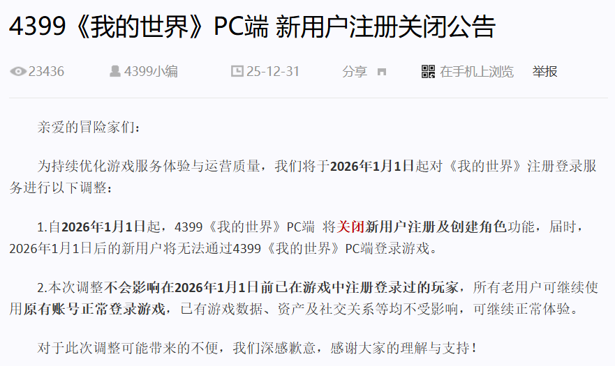
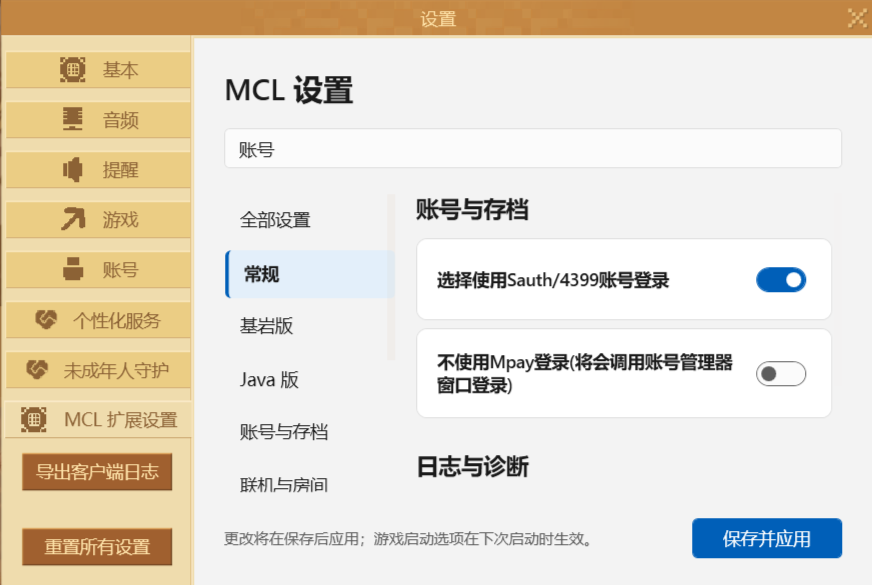
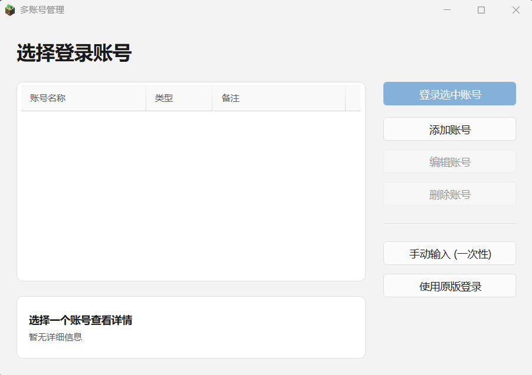
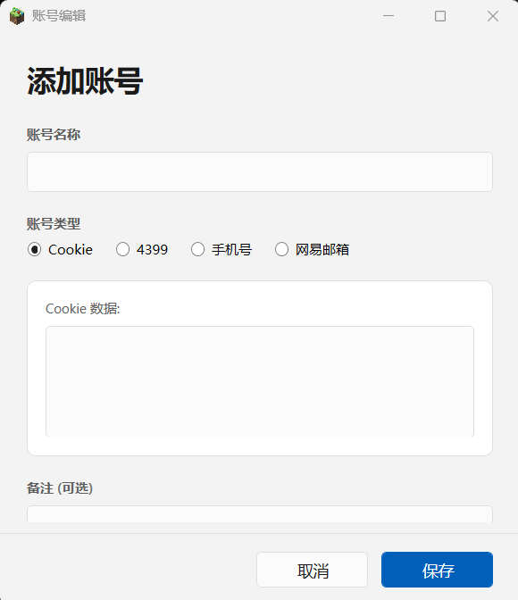
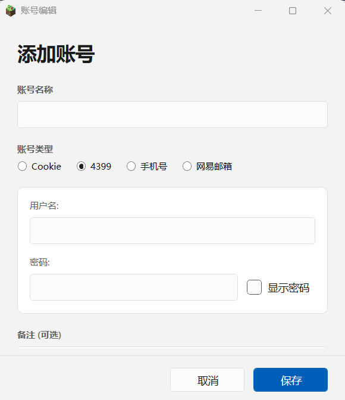
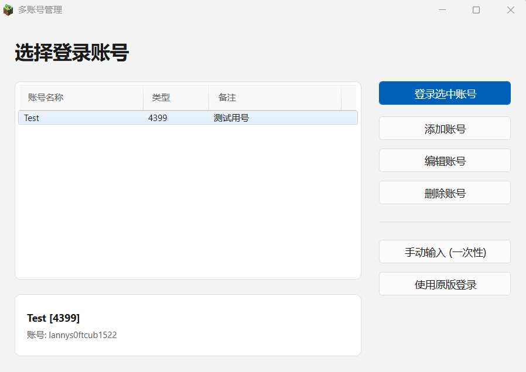

## 1.问题一览

-   
    4399启动器登录账号后，点击开始游戏即闪退，不显示任何错误信息。  
-   
    登录后显示“因渠道合作关系调整，新增账号登陆服务已停止”  
-   
    使用WPFLauncher_Hook的4399cookie多账号登录时显示登录失败。

## 2.问题产生原因

这三种情况都是因为同一种原因：

来自于[4399新闻](https://news.4399.com/gonglue/wdshijie/zixun/m/1009306.html)  
意思就是将无法通过4399启动器登录**2026.1.1之后**的账号。  
但是4399启动器限制登录**不代表无法登录**，这时我们可以下载WPFLauncher_Hook来实现。

## 3.解决方法

### 3.1 下载WPFLauncher_Hook

方法请看之前的文章"如何使用WPFLauncher_Hook"

### 3.2 配置WPFLauncher_Hook

前往页面的上方栏的"设置"-"MCL设置"，搜索到SAuth/4399登录

开启并保存设置，接下来只需要重启一次启动器就可以了

### 3.3 登录账号

由于4399Cookie同样会走4399平台的登录，导致同样会被拦截(就像刚才展示的第三章错误图片一样)  
所以不建议使用cookie登录，判断是否为4399cookie的方法就是找到login_channel"登陆渠道"的一项，看后面跟的是什么。渠道不只有4399pc和x19两种，还有4399com等，实际上**只要不是4399pc就可以放心登录**，如果是4399pc那你就可以扔了（不代表没用，只是在这个情境下用不到）  
  
然后就会进入多账号登录的管理器页面，点击"添加账号"。  
  
这个是添加账号的页面，可以添加多种的账号登陆，在这种情况下请使用4399登录(账号密码)  
  
输入完账号密码就会这样，**记得输入名称**不然点击添加账号是没反应的  
  
登录可能会需要验证码，自行输入即可  
  
完成就能正常进入了。  

