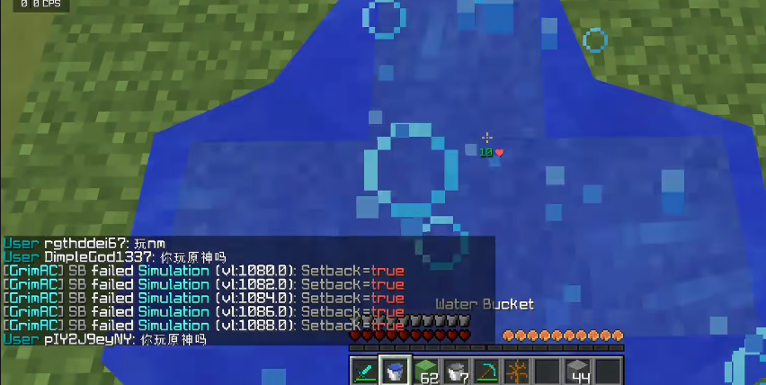
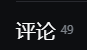
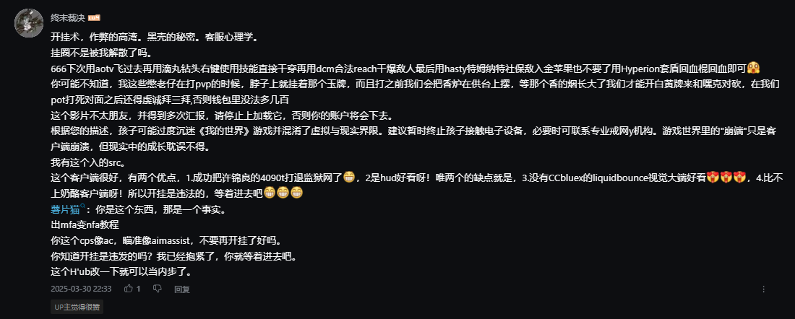
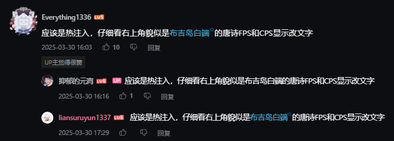
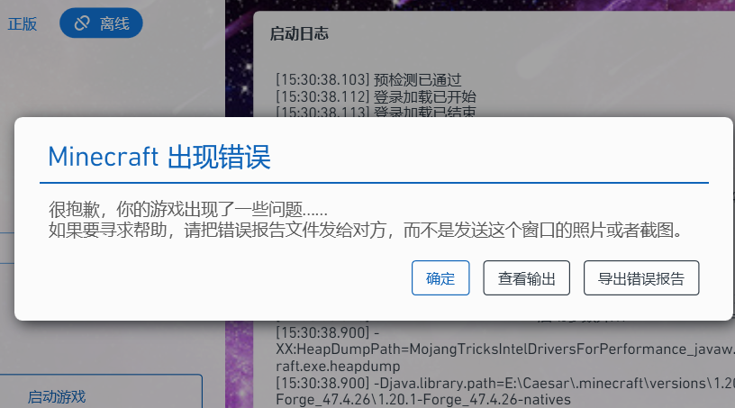

## 1.提醒

本文章仅针对于我的世界(主要为java版)外挂  
本文仅供参考  
由于看这个文档的大多数都是电脑来飘布吉岛的，所以可能会偏向于介绍这方面的客户端（介绍的客户端基本全部**免费**）。而且我已经很长时间没开挂了，所以信息可能比较滞后，将就看吧。

## 2.了解反作弊

### 2.1 考虑目的

在选择外挂之前，首先要明确你要在哪里使用外挂。  
如果你是在单人模式下使用，那么你可以随便挑选，毕竟是没有反作弊的情况，而且你使用了也并不违反任何规则。  
如果你是在多人模式下使用，就需要分为以下情况（以国际版服务器为例）：

- **服务器没有反作弊**(称为无反)：如HVH服务器与很多联机房间。基本上也可以像单人世界那么挑选，你可能需要的是生存端，因为不存在需要绕过反作弊的需求。  
- **服务器有微弱的反作弊**(称为弱反)：比如HVH服务器与少数小型服务器。基本上是一些检测飞行、违规NBT、百米大刀等过于强大功能的反作弊（部分服务端可能自带，如Paper），其实也可以使用生存端，但存在一定被检测的可能，可以自行衡量需求。  
- **服务器有反作弊**(称为有反)：绝大多数服务器。搭载一些常见的反作弊插件，如GrimAC，Matrix，NCP等，这类反作弊属于中等强度，可以检测大多数非视觉的功能，但在很多客户端中会被绕过。  
- **服务器有强反作弊**(称为强反)：一些服务器会搭载一些更强大的反作弊插件，如Polar。这类反作弊属于高强度，可以检测大多数非视觉的功能，导致不被检测到的暴力功能会很少。

网易服务器大多数属于"有反"类型（如布吉岛与原来的花雨庭（花雨庭只不过是反作弊被绕烂了，不是没有反作弊）），  
但基岩版服务器（如EC，Misaki）基本上属于"弱反"甚至"无反"类型。

### 2.2 考虑反作弊

以下是常见的反作弊列表：

- **[GrimAC](https://github.com/GrimAnticheat/Grim)(及其分支[LightningGrim](https://github.com/Axionize/LightningGrim))**：典型反作弊插件，通过数学模拟来检测玩家行为。个人感觉对于Reach和Hitbox的检测十分灵敏，但是Simulation误报率高。Grim在英语中是"严峻,阴冷,冷酷"的意思，因此你可以看到有人称之为严峻/冷酷反作弊。由于GrimAC使用十分**广泛**，对Grim的绕过也不少。使用Grim的典型服务器有布吉岛java版，花雨庭(老Grim)。且由于Grim对于通过geyser进入java服务器的基岩版玩家不生效，因此对于布吉岛基岩版玩家来说，绕过会更轻松。  
- **[Matrix](https://matrix.rip/zh/)**：同样是典型反作弊，检测方法是数据包分析、行为模式识别与机器学习。整体相比于Grim来说较强。Matrix会在背后召唤假人来检测杀戮光环（同时也基于k-NN机器学习来检测瞄准轨迹与点击是否正常），可以说**几乎是强反**。Matrix是矩阵的意思，因此你可以看到有人称之为矩阵反作弊。Matrix同样不生效于基岩版进入的玩家(据[文档](https://matrix.rip/zh/qa#%E5%AE%83%E8%83%BD%E6%A3%80%E6%B5%8B%E5%9F%BA%E5%B2%A9%E7%89%88%E7%8E%A9%E5%AE%B6%E5%90%97)称是因为由于过于复杂，同时维护两者代码库很困难)。  
- **NoCheatPlus(NCP)**：老牌反作弊(基本上是我的世界最早的反作弊)，根源可追溯至2011年8月31日(NoCheat 2.0)。本体基本上已经停止更新，但仍有持续活跃的分支。由于作弊客户端的加强，已经没多少人使用这个老资历反作弊了(目前还在使用的基本只有一些不追求强检测的2b2t服务器和一些小服务器)。  
- **[Polar](https://polar.top/)**：新兴反作弊，主要检测方法是云端检测和机器模拟。由于检测的目标是缓解而不是封禁，所以被检测到主要造成的效果不是封号而是降低伤害、限制移动与攻击距离。由于本反作弊并非完全开放购买(需要成熟服务器并申请许可证)，而且较为昂贵，因此使用的服务器较少。而且网易服务器对于这类上传信息的插件有限制，布吉岛等服务器基本不会使用Polar。polar是极地的意思，而且图标是北极熊，因此你可以看到有人称之为北极熊反作弊。使用polar的经典服务器是PikaNetwork。  
- **Vulcan**：同样是需要购买的反作弊(20$)，检测方法主要是数据包分析，目前来看使用的人较少。由于其名字为罗马神话中"火与工匠之神"的名字，且图标为火山，因此你可以看到有人称之为火神反作弊。  
- **WatchDog**：Hypixel的独家定制反作弊，据传基于NCP(因为Hypixel没使用watchdog之前用的就是NCP，而且在行为上也有一定相似之处)。被称为看门狗。  
- **Spartan**：比较冷门的反作弊。花雨庭关服前很长一段时间用的就是老GrimAC+Spartan的反作弊组合。被称为斯巴达反作弊。  
- **Intave**：已经停止更新的一个反作弊，了解较少。  
- **Themis**：一个比较冷门的反作弊。布吉岛由于Grim对于基岩版不生效，于是上了Themis反作弊(效果欠佳)。
  
### 2.3 理解反作弊原理

VL：VL 代表“Violation Level”（违规等级），是反作弊插件用来衡量玩家涉嫌作弊严重程度的系统。当玩家执行某些被反作弊系统认为可疑的行为时，自身带有的VL会增加。如果玩家的VL达到某个阈值，系统可能会采取行动，例如将玩家踢出游戏或封禁玩家。具体的阈值和后果可以由服务器管理员配置。  
VL警报类似于这种：，截图来自于[00:06](https://www.bilibili.com/video/BV1QV411T7m5/?)

反作弊如何检测：服务端反作弊无法直接“看到”作弊软件(除非检测模组,但这样对于热注入来说无效)，因此需要监听客户端发来的数据包，在服务器端建立一个“合法玩家的行为模型”，再对比实际数据是否违反游戏物理、规则或统计规律。如果发现玩家行为不属于正常玩家的范畴，则会反馈让系统决策如何处理这名玩家(包括但不限于:人工审核，减伤，强制返回大厅，踢出玩家，封禁)

## 3.了解外挂

### 3.1 外挂分类

以上的内容对于刚开始使用的人已经足够了，至于更系统的知识还需要自己摸索。以下是外挂的分类：

- **生存端**：指仅用于生存时的外挂，对于反作弊绕过普遍较差。如[MeteorClient](https://meteorclient.com/)彗星、[Wurst](https://www.wurstclient.net/)香肠、[Aristois](https://gitlab.com/Aristois/Installer)(不幸的是就在这篇文章写出的前一个月官网死了)等。  
- **绕过端**：这一部分没有什么统一的说法，反正与生存端对比可以叫绕过端。从名字可知这部分客户端就是为了绕过反作弊而产生的，这一部分客户端十分多样且巨多，所以这里只列出一些典型的客户端。绕过端包括但不限于：  
  - [LiquidBounce](https://liquidbounce.net/)水影及其家族：水影大概是与Vape名号同样响亮的外挂端，主要由CCBlueX制作。对于刚刚开始玩外挂的人来说这两个外挂的名字可谓是如雷贯耳远近闻名。本网页将其简称为LB。  
    - [LB Nextgen](https://github.com/CCBlueX/LiquidBounce/tree/nextgen)："水影下一代"，简称LBNG，指的是由CCBlueX创立的面向新版本的水影端，在界面上更加美丽，对于界面的可操作性更大(对于theme来说)，绕过也更新。本版本的下载有时候会卡顿，尤其总有人不通过官方下载导致自己缺Kotlin前置。本模组最好搭配ViaFabricPlus。  
    - [LB Legacy](https://github.com/CCBlueX/LiquidBounce/tree/legacy)："水影遗产"，指的是CCBlueX的老版本水影，主要是1.8.9和1.12.2。*不知道为什么现在还有人用所谓"水影b2 汉化版"*。目前最新的版本是b100+。  
    以上两者均为水影的官方分支，接下来则是水影家族的冰山一角（仅用于讲解，以下这四种客户端基本没人用了）：  
    - LB+："水影Plus"，很早的一个分支，目前已经基本见不到了。  
    - LB++："水影PlusPlus"，也比较早了，版本为1.8.9Forge。  
    - Pride："骄傲"，老分支，应该是LangYa写的，2023年活跃。  
    - PridePlus："骄傲Plus"，老分支，同样活跃于2023年。  
    老的基于水影的客户端太多了，这些属于是很少的一部分。  
    - CloudBounce：基于LBNG的客户端，2025年后半年活跃（目前看到的很少）。  
    - BMWClient：宝马客户端，基于LBNG的客户端，到今年上半年仍然能看到在布吉岛的使用视频。  
  - Naven：又称N@ven或纳纹，知名布吉岛客户端，最早视频似乎是2024-09-28的。全名NavenModern，现在还能看到其二改。  
  - Southside：南方客户端。懒得讲了太多了。  
  - 等等等等。这部分实在是太多了，根本没办法一次性讲完。  
- **热注入**：这部分也是比较庞大的，基本也具有绕过的功能。由于其是在游戏启动后注入进游戏里的，同时也具有一定的隐蔽性。  
  - [Vape](https://www.vape.gg/)：这部分可以说是低智重灾区了，由于其名声极其响亮，一堆压根没接触过外挂的人想用，但是又买不起，于是[OpenVape](https://github.com/OpenVapeCN/OpenVape)变成了xxs滋生的地方。我建议**不要使用Vape作为你常用的外挂**，先不说辱华的问题，使用vape破解会导致你出现n个错误以及被群里一些人投毒(后门或者锁机)，在解决之后又打不过别的挂，除了界面好看一点、提供了一点点游戏优势以外其他没有什么用处。  
  - [Doomsday](https://doomsdayclient.com/)：这是一个免费的热注入(官网上写未来可能会出收费版本)，作者仍然持续更新，目前的缺点就是无杀戮光环和广泛的功能，可以搭配其他客户端使用  
  - [Zen](https://github.com/Margele/OpenZen)：名字似乎来自绝区零的英文(ZenlessZoneZero)，知名布吉岛客户端。自从Margele将Zen开源后OpenZen的二改简直是百花齐放，现在还能看到Zen的二改。  
- **网易基岩版的外挂**：简单讲一下，主要是两类，电脑版和手机版。电脑版分为DLL和CT(CheatEngine)两类；手机版不太了解，这部分就不多讲了。  
  - DLL这部分基本都是付费的，就是Nolstice之类  
  - CT就是CheatTable的意思，CheatEngine写完之后保存的表，打开之后可以快捷修改内存内项，达到一定外挂的效果。

### 3.2 下载方法(仅对于刚入门者来讲)

如果你先看到了这个客户端的使用视频或者宣传视频（这里随便选一个Naven的视频举例子：[Naven Modern 1.20.1](https://www.bilibili.com/video/BV1HvZqYoEue/?)）  
如果视频时间比较新的话可以看看下面的简介与评论：  
  
魔怔反串的不用管(实际上绝大多数都是魔怔反串的,特征就是模仿小学生语音输入(逗号句号巨多，看起来智商不高，还有瞎骂的可以忽略)，复读机，或者特别严肃认真的说一件一眼就能看出来的事情，如果你也认真那你就输了)，以下是示例：  
  
  
最终从本来就不多的有用信息中看到粉丝群，如果没有群之类的话自己去[必应](https://cn.bing.com/)或者百度搜索客户端名称或者关键词，建议只看GitHub链接以及其他相关视频(同平台，如bilibili最好)链接，如果找不到基本可以相信这个客户端是私有不公开的（当然也有可能视频中会标注）

### 3.3 安装方法

安装方法基本都一样，先看这个客户端是什么样的客户端(也有可能是病毒，仔细辨别)，如果是exe文件那么可能是热注入，如果是jar文件那么可能是游戏本体或模组(主要区分方法可以看名字里有没有Forge、Fabric之类的关键词，或者这个客户端是zip文件里面带有一个jar一个json的，这种就是游戏本体需要释放到versions文件夹中，如果是模组就需要放到mods文件夹中(注意版本隔离))  
然后游戏本体的jar最大的一点问题(绝大多数新人都踩过的坑)就是被官方游戏本体覆盖了，这时候就需要关闭文件校验(添加游戏参数-noverify或者在启动器设置中找"关闭游戏校验"，如果仍然无效就启动一次游戏之后再替换一次游戏本体，绝大多数情况下可以成功)  
热注入就是在游戏启动之后再打开文件，然后注入(Inject)。

基本上就这样，不会的尽量好声好气在群里问，礼貌询问的话会有人回答你的，但是尽量别让别人操控自己的电脑或者随便下载别人发给自己的文件，不一定里面有什么病毒，可以找人私信，给别人截图电脑(一定要**完整截图**，我已经收到不知道多少次的一半截图，正好把需要的部分忽略在图外了)，让别人告诉你从哪里操作，应该怎么做之类的

如果是报错崩溃，**不要只截图崩溃界面**（如图：），要不然就发日志(下方查看输出或者导出错误报告都可以)，要不然就录屏全过程(建议两者都发)，然后一定要礼貌因为别人不欠你什么东西

### 3.4 常见误区

有人觉得付费的一定就是好，免费的一定就是差，所以我必须得砸钱我必须得付费，实际上你付费买的就是一个功能，功能是由人来决定是不是开启的，你买的不是一个全自动Bot(就算是Bot也得比算法和思路)，你开完挂打不过绿玩你就觉得是外挂的问题，实际上只要这个客户端打起来不容易回弹、不在后台给你叠VL、两者功能相差不多，比较的第一就是

- 智商差距(IQ、思路差距，谁开的明白谁开不明白)，这点可以说是最主要的，不论HvH(黑客互殴)还是PvH(自己造的词)(起床空岛主播最喜欢的诛仙环节)，本身竞技类游戏比拼的就是思路  
- 功能差距(比谁开的暴力，比谁拉的大)，这个比的就是配置，比谁的配置能更接近于反作弊下能达到的最高水准，在不被检测到的情况下开的暴力(如果有客服那就另算)  
- 算法差距(比谁的端好)，这最后比的才是客户端的强弱。

起床空岛这类游戏本身就是考验自己思路、实力和团队协作的能力，有些xxs开个挂觉得自己老牛逼了，实际上遇到会开的或者会玩的还是啥也不是，最后还赖端不行，不知道意味何在

