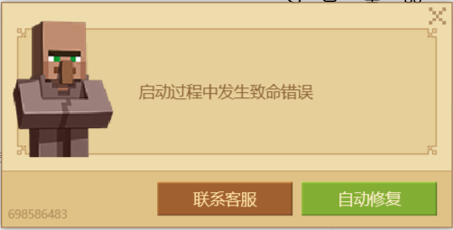
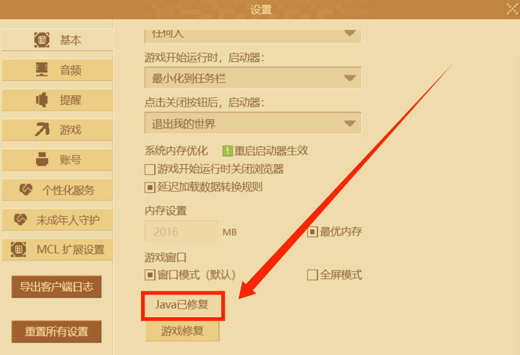
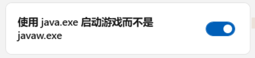
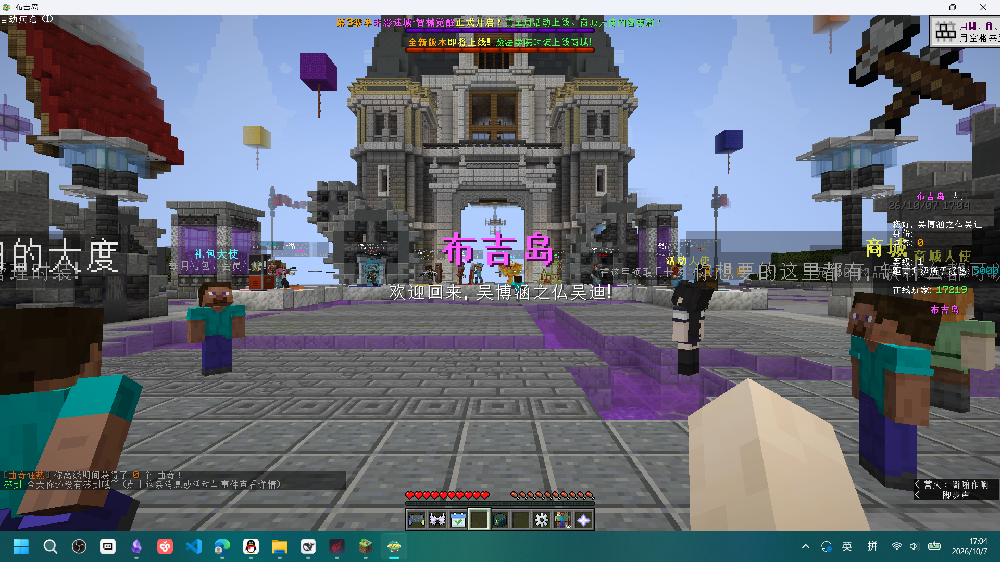

如果启动布吉岛时出现此类致命错误、无法进入游戏，请按照以下内容操作。

## 1. 问题现象

启动时提示致命错误，无法正常进入游戏。

## 2. 修复 Java 环境

老版本的 Java17 已经被网易替换为 **Java22**。所以如果在命令行窗口发现报错和**找不到 javaw.exe** 有关时，可以使用以下这个 Java 修复工具。原理是重新下载 Java22，并删除你自己原来的老 Java。

## 3. 关于后续启动

需要知道的是，只要**正常启动过一次游戏**，之后再次启动基本就不会出现什么问题。

## 4. 调整 WPFLauncher_Hook

请按照以下图片对 WPFLauncher_Hook 进行调整：

  

## 5. 测试

接下来可以测试一下能不能正常启动布吉岛：**删除原有的下载，重新下载布吉岛**。

这种操作可以修复约 **60%** 的致命错误情况。

> 我估计是游戏完整性审查的问题，但是没测出来。

## 6. 登录建议

最好**第一次登录使用自己没风险的大号**。

确认大号成功进入后，小号也可以进入。
